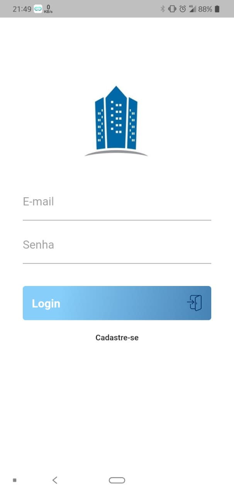
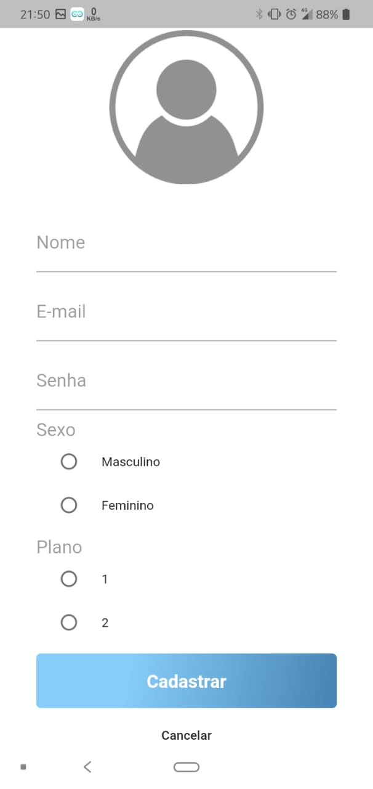
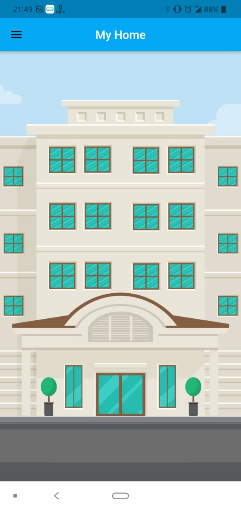
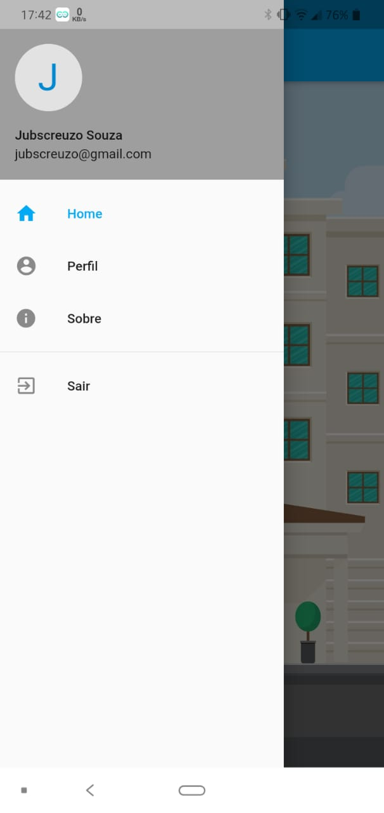
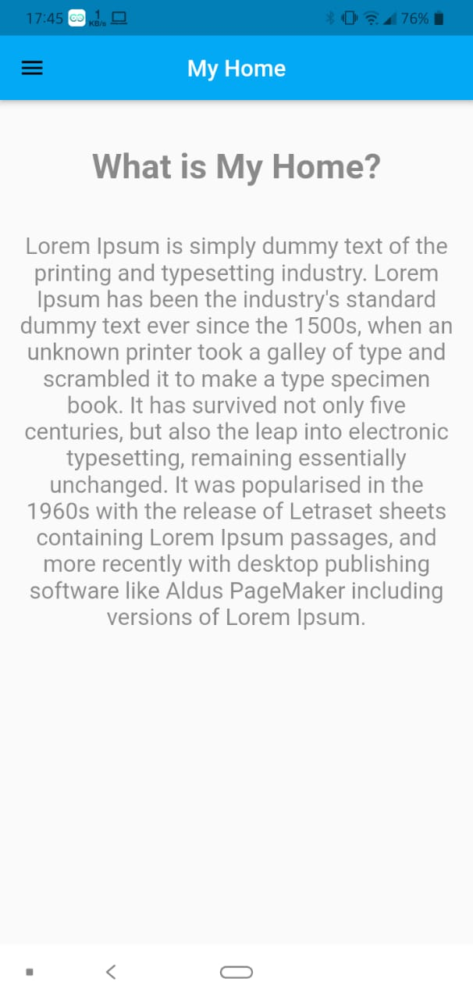
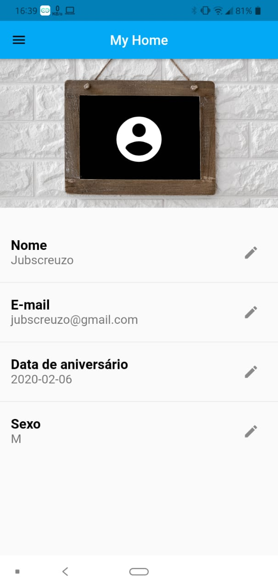
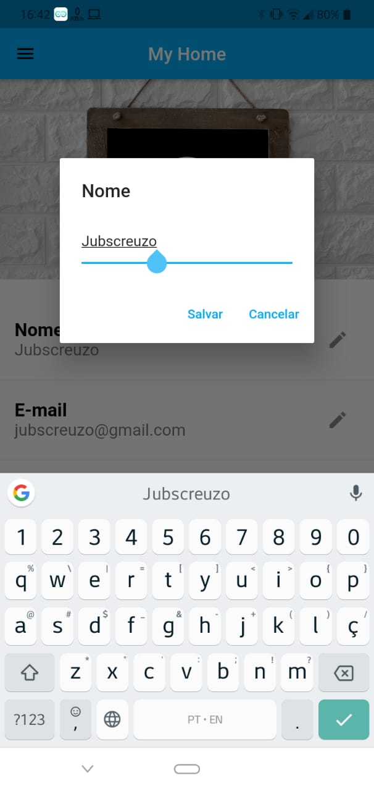
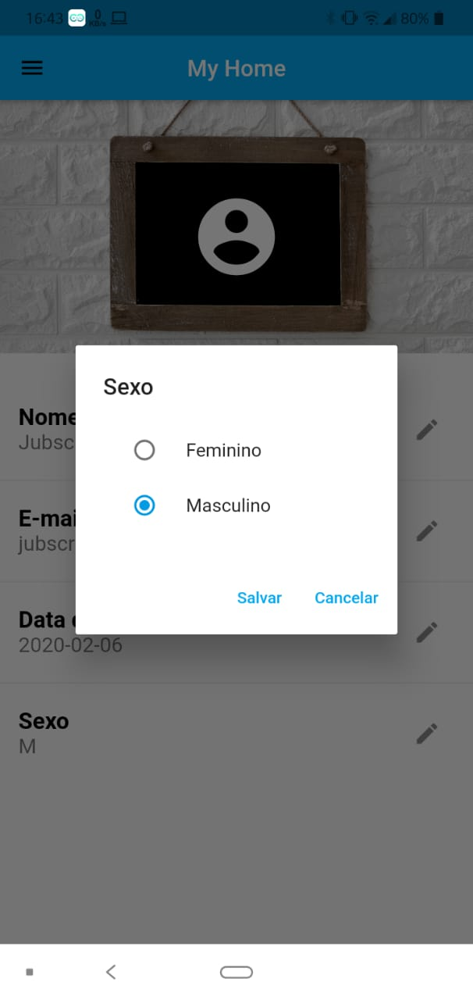

# myhome

<h3>Funcionalidades implementadas:</h3>
• Sign In 
• Sign Up 
• Sign Out 
• Acessar o menu de opções 
• Consultar Perfil 
• Atualizar Perfil 

<h3>Para executar no Visual Studio:</h3>
• Selecione o projeto 
• Abra o terminal 
• Execute o comando cd "diretorio_da_pasta_do_projeto" 
• Em seguida execute o comando "flutter pub get" 
• Após execute o comando "flutter run" 

<h3>Screenshots</h3>

 Projeto em Flutter. 

Desenvolvido com o editor Visual Studio Code.